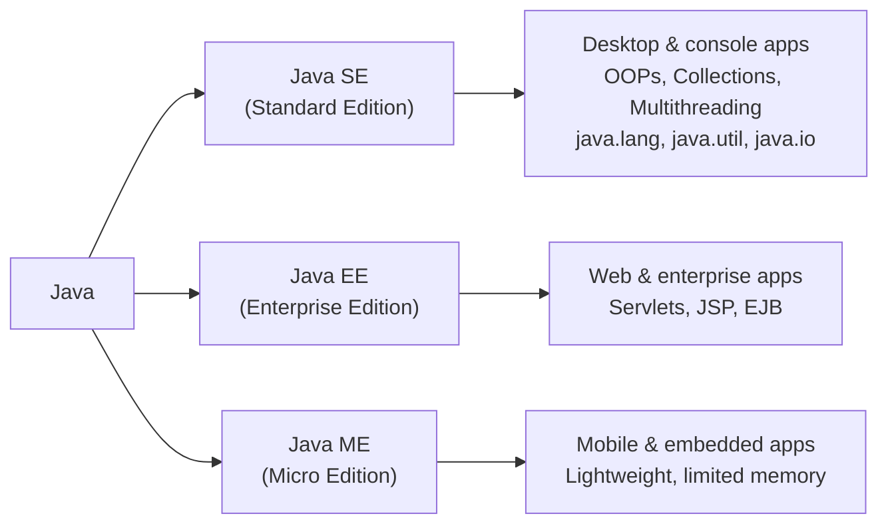
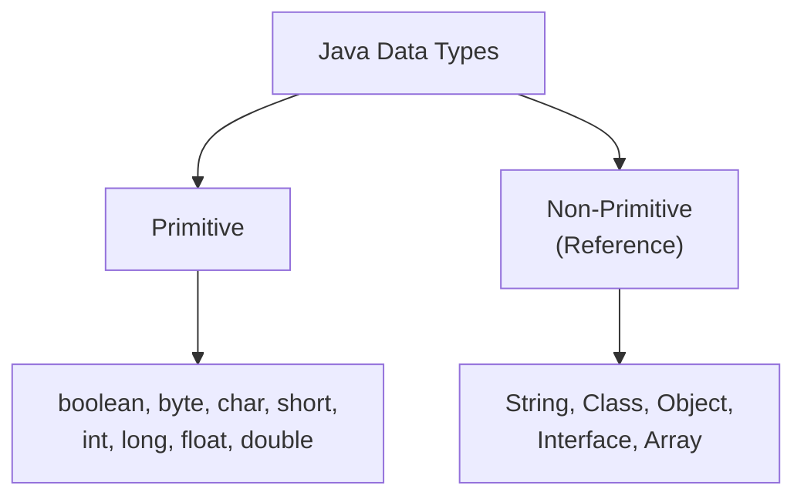
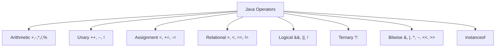
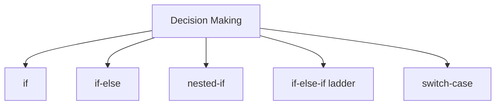
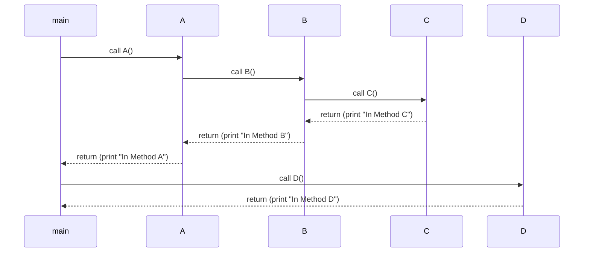
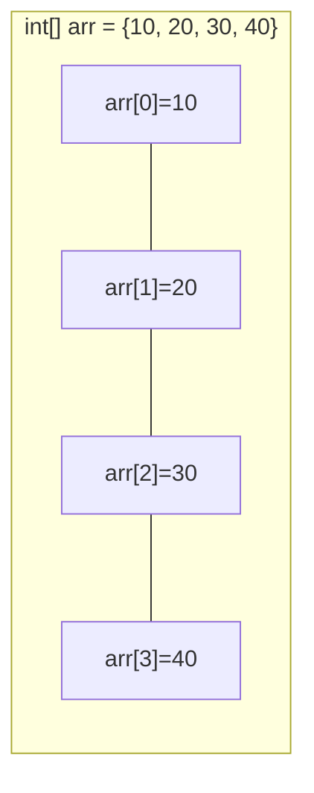
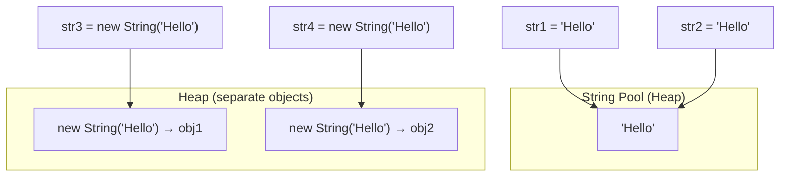

# Core Java — Complete Notes

---

## 1. What is Core Java?

**Core Java** is the fundamental part of Java used to build general-purpose applications. It covers the base concepts — OOPs, exception handling, collections, multithreading, JDBC — that everything else (Spring, Hibernate, etc.) is built on top of.

- Belongs to **Java SE (Java Standard Edition)**
- Used to build **standalone / desktop applications**
- Forms the foundation for understanding advanced Java frameworks

### Java Editions



| Edition | Purpose | Key Tech |
|---|---|---|
| **Java SE** | Desktop / standalone apps | OOPs, Collections, Multithreading |
| **Java EE** | Enterprise / web apps | Servlets, JSP, EJB |
| **Java ME** | Mobile / embedded systems | Lightweight APIs |

### Why Core Java Matters
- Foundation for Advanced Java & frameworks (Spring, Hibernate)
- Teaches OOP fundamentals
- Applicable across desktop, web, mobile, and enterprise development

### Core Java vs Advanced Java

| Aspect | Core Java | Advanced Java |
|---|---|---|
| Definition | Fundamental Java concepts | Advanced/enterprise concepts |
| Scope | General application development | Enterprise application development |
| Edition | Java SE (J2SE) | Java EE (J2EE) |
| Topics | Threading, Swing, OOP, data types, operators, exceptions | Web services, Servlets, JSP, DB connectivity, EJB |
| Architecture | Single-tier (standalone) | Two-tier (client–server) |
| Role | Prerequisite | Specialization |

---

## 2. Variables

A **variable** is a named container for storing data in memory. Every variable has:
1. **Data Type** — kind of data (`int`, `String`, `float`…)
2. **Variable Name** — a unique identifier
3. **Value** — the actual data stored

```java
class Geeks {
    public static void main(String[] args) {
        int age = 25;
        String name = "GeeksforGeeks";
        double salary = 50000.50;

        System.out.println("Age: " + age);
        System.out.println("Name: " + name);
        System.out.println("Salary: " + salary);
    }
}
```
**Output:**
```
Age: 25
Name: GeeksforGeeks
Salary: 50000.5
```

### Naming Rules
- Must start with a letter, `$`, or `_`
- Cannot be a reserved keyword (`int`, `class`, `if`, …)
- Case-sensitive (`age` ≠ `Age`)
- After the first character: letters, digits, `$`, `_` allowed
- No spaces allowed
- Use **camelCase** convention (`totalMarks`, `studentName`)
- Prefer descriptive names over single letters

---

## 3. Data Types

Java data types tell the compiler how much memory to allocate and what operations are valid. Two categories:



### 3.1 Primitive Data Types

| Type | Description | Default | Size | Example | Range |
|---|---|---|---|---|---|
| `boolean` | Logical value | `false` | JVM-dependent | `true`, `false` | true / false |
| `byte` | 8-bit signed int | `0` | 1 byte | `10` | -128 to 127 |
| `char` | 16-bit Unicode char | `\u0000` | 2 bytes | `'A'` | 0 to 65,535 |
| `short` | 16-bit signed int | `0` | 2 bytes | `2000` | -32,768 to 32,767 |
| `int` | 32-bit signed int | `0` | 4 bytes | `1000` | -2,147,483,648 to 2,147,483,647 |
| `long` | 64-bit signed int | `0L` | 8 bytes | `123456789L` | ±9.22×10¹⁸ |
| `float` | 32-bit floating point | `0.0f` | 4 bytes | `3.14f` | ~6–7 digit precision |
| `double` | 64-bit floating point | `0.0d` | 8 bytes | `3.14159d` | ~15–16 digit precision |

**Quick examples:**
```java
boolean isJavaFun = true;          // boolean
byte age = 25;                     // byte
short students = 1000;             // short
int population = 2000000;          // int
long worldPopulation = 7800000000L; // long — note the 'L' suffix
float pi = 3.14f;                  // float — note the 'f' suffix
double preciseValue = 3.141592653589793; // double
char grade = 'A';                  // char
```

### 3.2 Non-Primitive (Reference) Data Types

Store **references** to objects rather than raw values.

| Type | Description |
|---|---|
| **String** | Sequence of characters; **immutable** object |
| **Class** | User-defined blueprint for objects |
| **Object** | Instance of a class (state + behavior + identity) |
| **Interface** | Contract of abstract methods; enables abstraction & multiple inheritance |
| **Array** | Fixed-size collection of same-type elements, 0-indexed |

```java
// String
String name = "Geek1";

// Class + Object
class Car {
    String model; int year;
    Car(String model, int year) { this.model = model; this.year = year; }
    void display() { System.out.println(model + " " + year); }
}
Car myCar = new Car("Toyota", 2020);
myCar.display(); // Toyota 2020

// Interface
interface Animal { void sound(); }
class Dog implements Animal {
    public void sound() { System.out.println("Woof"); }
}
Animal dog = new Dog();
dog.sound(); // Woof

// Array
int[] numbers = {1, 2, 3, 4, 5};
```

### Why Data Types Matter
- Type safety — prevents invalid assignments
- Efficient memory usage
- Improves performance & readability
- Compiler catches type errors early

---

## 4. Operators



### 4.1 Arithmetic Operators
```java
int a = 10, b = 3;
int sum = a + b;   // 13
int diff = a - b;  // 7
int mul = a * b;   // 30
int div = a / b;   // 3  (integer division truncates)
int mod = a % b;   // 1
```

### 4.2 Unary Operators
```java
int a = 10;
System.out.println(a++); // 10 (post-increment: use then increment)
System.out.println(++a); // 12 (pre-increment: increment then use)
```

### 4.3 Assignment Operators
```java
int num = 10;
num += 5;  // 15
num *= 2;  // 30
num -= 5;  // 25
num /= 2;  // 12
num %= 3;  // 0
```

### 4.4 Relational Operators
Return boolean results: `>`, `<`, `>=`, `<=`, `==`, `!=`

### 4.5 Logical Operators
```java
boolean x = true, y = false;
x && y  // false (AND)
x || y  // true  (OR — short-circuits)
!x      // false (NOT)
```

### 4.6 Ternary Operator
```java
int result = (a > b) ? a : b; // shorthand if-else
```

### 4.7 Bitwise Operators
```java
int d = 0b1010, e = 0b1100;
d & e   // AND
d | e   // OR
d ^ e   // XOR
~d      // NOT
d << 2  // left shift (×4)
e >> 1  // right shift (÷2)
e >>> 1 // unsigned right shift
```

### 4.8 instanceof Operator
```java
String str = "Hello";
str instanceof String; // true — runtime type check
```

### ⚠️ Common Mistakes
- Confusing `==` (equality) with `=` (assignment)
- Comparing `float`/`double` with `==` (precision issues)
- Forgetting integer division truncates decimals
- Overusing `+` for string concatenation inside loops (creates new objects each time — use `StringBuilder`)

---

## 5. Decision-Making Statements



### 5.1 `if` Statement
```java
if (i < 15) {
    System.out.println("Condition is True");
}
```
Flow: condition evaluated → if true, block runs → otherwise skipped → continue.

### 5.2 `if-else`
```java
if (i < 15) System.out.println("smaller");
else System.out.println("greater");
```

### 5.3 Nested-if
```java
if (i < 15) {
    if (i == 10) System.out.println("i is exactly 10");
}
```

### 5.4 if-else-if Ladder
```java
if (i == 10) System.out.println("i is 10");
else if (i == 15) System.out.println("i is 15");
else if (i == 20) System.out.println("i is 20");
else System.out.println("not present");
```

### 5.5 Switch-Case
```java
switch (num) {
    case 5:  System.out.println("It is 5"); break;
    case 10: System.out.println("It is 10"); break;
    default: System.out.println("Not present");
}
```
- Expression type: `byte`, `short`, `int`, `char`, `enum`, or `String` (JDK7+)
- Duplicate case values not allowed
- `default` is optional
- Without `break`, execution **falls through** to the next case

### 5.6 Ternary Operator (recap)
```java
int max = (a > b) ? a : b;
```

### if-else vs switch-case

| Feature | if-else | switch-case |
|---|---|---|
| Use case | Condition-based checks, ranges | Exact value matching |
| Readability | Better for few conditions | Better for many cases |
| Performance | Slower for many checks | Faster/optimized for many cases |
| Flexibility | Supports ranges & complex conditions | Exact matches only |

---

## 6. Methods

A **method** is a reusable block of code that performs a specific task. All Java methods belong to a class.

### Syntax
```java
returnType methodName(parameters) {
    // method body
    return value; // optional, only if returnType != void
}
```

**Components:**
- **Modifier** — `public`, `private`, `protected`, default
- **Return type** — or `void`
- **Method name** — camelCase, starts with a lowercase verb
- **Parameters** — optional inputs
- **Body** — the logic

### Why Use Methods?
- **Reusability** — write once, use many times
- **Modularity** — each method handles one task
- **Readability** — smaller, named blocks
- **Maintainability** — easier debugging & updates

### Method Call Stack
Java manages method execution using a **call stack** (LIFO — Last In, First Out).



```java
public class CallStackExample {
    public static void D() { System.out.println("In Method D"); }
    public static void C() { System.out.println("In Method C"); }
    public static void B() { C(); System.out.println("In Method B"); }
    public static void A() { B(); System.out.println("In Method A"); }
    public static void main(String[] args) { A(); D(); }
}
```
**Output:**
```
In Method C
In Method B
In Method A
In Method D
```
Each call pushes a **stack frame**; when the method finishes, its frame is popped and control returns to the caller.

### Types of Methods

| Type | Description | Example |
|---|---|---|
| **Predefined** | Built into Java's standard library | `Math.random()` |
| **User-defined** | Written by the programmer | `sayHello()`, custom methods |

### Instance vs Static Methods
```java
// Instance method — needs an object
void method_name() { }

// Static method — belongs to the class
static void method_name() { }
```

### Method Signature
Consists of **method name + parameter list** (number, type, order). Return type & exceptions are **not** part of the signature.
> `max(int x, int y)` → 2 params, both `int`.

### Naming a Method
- Start with a lowercase verb
- Multi-word → camelCase
- Must be unique in class (unless overloaded)

### Calling Methods — 4 Ways
```java
// 1. User-defined (via object)
Geeks obj = new Geeks();
obj.hello();

// 2. Abstract method (implemented in subclass, called via subclass object)
Geeks obj2 = new Geeks(); // Geeks extends abstract class
obj2.check("GeeksforGeeks");

// 3. Predefined method
obj.hashCode();

// 4. Static method (no object needed)
Test.hello();
```

---

## 7. Arrays

An **array** is a fixed-size collection of elements of the same type, stored in contiguous memory. Indexing starts at **0**.

- Primitive arrays → elements stored directly in contiguous memory
- Non-primitive arrays → references to objects stored contiguously
- **Size is fixed** once created (use `ArrayList`/`Vector` for dynamic sizing)



### Declaration & Initialization
```java
int[] arr;                  // declaration
arr = new int[5];           // initialization (memory allocated, default 0s)
int[] arr2 = {1, 2, 3};     // array literal (no 'new' needed)
```

### Core Operations

**Access:**
```java
int[] arr = {2, 4, 8, 12, 16};
System.out.print(arr[3]); // 12  (0 ≤ index ≤ length-1)
```

**Update:**
```java
arr[0] = 90; // updates first element
```

**Traverse:**
```java
for (int i = 0; i < arr.length; i++) {
    System.out.print(arr[i] + " ");
}
```

**Size:**
```java
arr.length // number of elements
```

### Array of Objects
```java
class Student {
    int roll_no; String name;
    Student(int roll_no, String name) { this.roll_no = roll_no; this.name = name; }
}
Student[] arr = new Student[5];
arr[0] = new Student(1, "aman");
```

### Out-of-Bounds Access
Accessing an invalid index (negative, or ≥ length) throws:
```
ArrayIndexOutOfBoundsException
```

### Passing / Returning Arrays
```java
// Pass to method
public static void sum(int[] arr) {
    int sum = 0;
    for (int i = 0; i < arr.length; i++) sum += arr[i];
    System.out.println(sum);
}

// Return from method
public static int[] m1() {
    return new int[] {1, 2, 3};
}
```

### Advantages
- O(1) index access
- Predictable, simple memory management
- Structured data organization

### Limitations
| Limitation | Better Alternative |
|---|---|
| Fixed size | `ArrayList` (dynamic resizing) |
| Only same data type | `Collections`, `Object[]`, custom classes |
| Costly insert/delete (shifting) | `LinkedList` |

---

## 8. Strings

A **String** is an object storing a sequence of characters using **UTF-16** encoding, enclosed in double quotes.

- **Immutable** — value cannot change after creation; any "modification" creates a new object
- Rich built-in API for manipulation, comparison, concatenation

```java
String str = new String("Geeks"); // using 'new'
```

### Two Ways to Create a String

| Method | Memory | Behavior |
|---|---|---|
| **String literal**: `String s = "Geeks";` | String Pool (heap) | Reuses existing pooled object if the literal already exists |
| **`new` keyword**: `String s = new String("Geeks");` | Heap (new object) | Always creates a new object, even if the literal exists in the pool |



### CharSequence Interface & Related Classes

| Class | Mutable? | Thread-safe? | Notes |
|---|---|---|---|
| `String` | ❌ No | — | Immutable; changes create new objects |
| `StringBuffer` | ✅ Yes | ✅ Yes | Good for multithreaded manipulation |
| `StringBuilder` | ✅ Yes | ❌ No | Faster; single-threaded use |
| `StringTokenizer` | — | — | Splits strings into tokens by delimiter |

### Immutability Demonstration
```java
String str = "Hello";
str.concat(" World"); // creates new object "Hello World" — discarded, not assigned
System.out.println(str); // still "Hello"
```

### `intern()` Method
Returns the canonical (pooled) reference for a string. If not already in the pool, it's added; otherwise, the existing pooled reference is returned.
```java
String internedString = demoString.intern();
```

### String Pool History
- **Before Java 7**: String Pool lived in **PermGen**
- **Java 7 onward**: String Pool moved to the **regular heap**, allowing the Garbage Collector to manage pooled strings like any other heap object

```java
String s1 = "TAT";              // pool
String s2 = "TAT";               // reuses s1's pool object
String s3 = new String("TAT");   // new heap object #1
String s4 = new String("TAT");   // new heap object #2
// All print "TAT", but s1==s2 (same pool ref), s3 and s4 are distinct objects
```

> **Key takeaway:** All objects in Java live on the **heap**; reference variables live on the **stack** (or inside other objects, which are themselves on the heap).

---

## Quick Reference Summary

| Topic | Key Point to Remember |
|---|---|
| Core Java | Foundation of Java SE — OOP, exceptions, collections, threads, JDBC |
| Variables | Data type + name + value; camelCase; case-sensitive |
| Data Types | 8 primitives (fixed size/range) + 5 non-primitive reference types |
| Operators | Arithmetic, unary, assignment, relational, logical, ternary, bitwise, instanceof |
| Decision Making | if/if-else/nested-if/ladder for conditions; switch for exact-value matching |
| Methods | Reusable code blocks; call stack is LIFO; instance vs static |
| Arrays | Fixed-size, 0-indexed, contiguous memory, `.length` property |
| Strings | Immutable; String Pool vs heap; use `StringBuilder` for heavy manipulation |

